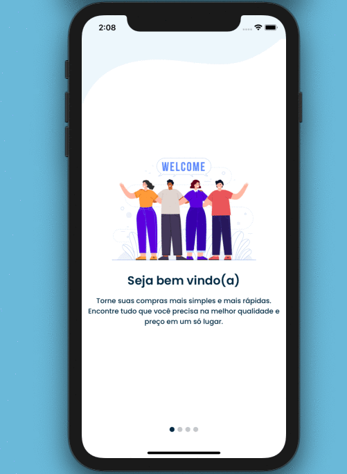

<h1 align='center'>
Suppy
</h1>

<h4 align="center"> 
	 Status: Finished
</h4>

<p align="center">
 <a href="#about">About</a> •
 <a href="#features">Features</a> •
  <a href="#tech-stack">My Tasks</a> •
 <a href="#layout">Layout</a> • 
 <a href="#tech-stack">Tech Dependencies</a> •

</p>

## About

♻️ O suppy um aplicativo de compras, tendo o seu diferencial a possibilidade de efetuar um match entre o produto escolhido pelo cliente e o fornecedor que esteja disponível a atendê-lo.

##### english

The suppy is a shopping application, with its differential being the possibility of making a match between the product chosen by the customer and the supplier that is available to serve him

---

## Features

- [x]  Usuário pode se logar e se registrar através de e-mail ou Google / User can login and register via email or Google
- [x]  Usuário pode ver lista de categorias de produtos disponíveis / User can see list of available product categories 
- [x]  App permite buscar produto por descrição / App allows to search for product by description

- [x]  Usuário pode preencher preferências / User can fill preferences:
    - De tipo de pagamento / Payment type
    - De tipo de recebimento (entrega ou retira) / Receipt type (delivery or withdraw)
- [x] Usuário pode fazer match de produto, utilizando / User can match product using:
    - Tamanho, cor, tipo, marca, quantidade entre outras formas / Size, color, type, brand, quantity among and other ways.
- [x] Usuaio cria carrinho de compras / User creates shopping cart
- [x] App envia cotação com o carrinho criado e envia para a plataforma das distribuidoras / App sends quotation with the cart created and sends it to the distributors platform
- [x] App retorna as respostas das distribuidoras com os produtos, preços e caso não tenham disponíveis, enviam uma sugestão de produto semelhante ou qualquer outro problema (usuário precisa aceitar ou recusar) / App returns the responses of the distributors with the products, prices and if not available, send a suggestion for a similar product or any other problem (user must accept or decline)
    -  Pedido é criado e a distribuidora fica pendente de aceitar ou recusar / Order is created and the distributor is pending to accept or refuse
- [x] App mostra a distância entre o cliente e a distribuidora, através de geolocalização / App shows the distance between the customer and the distributor, by geolocation 
- [x] App envia notificação da resposta da distribuidora / App sends notification of distributor response
- [x] Usuário pode ver listagem de pedidos / User can see list of orders
- [x] Usuário pode ver listagem de notificações / User can see list of notifications
- [x] Usuário pode ver gráficos / User can see graphs
- [x] App possui área de configurações / App has settings area    

---

## My Tasks

Este pojeto foi o mais longo e desafiador que pude trabalhar, as interfaces exigiram um bom cuidado para que se torna-se atrativo ao suário, os feedbacks durante a criação e as constantes mudanças para atingir um nivel satisfatorio de aplicação para o publico, trouxe um ótimo aprendizado em relação a identificar as necessidades dos clientes.

Neste projeto tive meu primeiro contato publicando um aplicativo nas lojas da Google e da Apple e sem contar as ferramentas que pude configurar, sendo elas:
notificaçãoes, compartilhamento de pedido via whatApp, Linking direcionando para o aplicativo instalado no device entre outras novidades, me proporcionaram uma ótima experiência.


##### english

This project was the longest and most challenging that I could work on, the interfaces demanded a good care so that it becomes attractive to the user, feedbacks during creation and the constant changes to reach a satisfactory level of application for the public, brought a great learning in relation to identifying customer needs.

In this project I had my first contact publishing an application in Google and Apple stores and not counting the tools I was able to configure, for example:
notifications, order sharing via whatApp, Linking directing to the application installed on the device, and many new things, provided me with a great experience.

---

## Layout



## Tech Dependencies

Lista de dependências utilizada para construção deste projeto / List of dependencies used to build this project:

```javascript
"dependencies": {
    "@fortawesome/fontawesome-svg-core": "^1.2.30",
    "@fortawesome/free-solid-svg-icons": "^5.14.0",
    "@fortawesome/react-native-fontawesome": "^0.2.5",
    "@react-native-community/async-storage": "^1.11.0",
    "@react-native-community/masked-view": "^0.1.10",
    "@react-navigation/drawer": "^5.9.0",
    "@react-navigation/native": "^5.7.2",
    "@react-navigation/stack": "^5.8.0",
    "@types/styled-components": "^5.1.2",
    "axios": "^0.20.0",
    "react": "16.13.1",
    "react-native": "0.63.0",
    "react-native-bluetooth-serial-next": "^1.2.3",
    "react-native-gesture-handler": "^1.7.0",
    "react-native-modal": "^11.5.6",
    "react-native-orientation-locker": "^1.2.0",
    "react-native-reanimated": "^1.10.1",
    "react-native-responsive-screen": "^1.4.1",
    "react-native-restart": "^0.0.17",
    "react-native-safe-area-context": "^3.1.1",
    "react-native-screens": "^2.9.0",
    "react-native-sound": "^0.11.0",
    "react-native-svg": "^12.1.0",
    "styled-components": "^5.1.1"
  }
```


###Images or Gif


